# Hello World, Hello Pi! 你好世界，你好圆周率!

在熬过了高三上的罕见病之后，上大学了！正在学习打习题爱抚，大佬们好可怕QwQ

终于有时间把Github首页重写一遍了 ~~(其实是被自己早年的文字豪到了，于是决定重写一遍，谁年少不是一个嘉豪呢😅)~~

---

我是圆周率，~~你可以叫我圆神（bushi~~，现在就读于*北京等通知大学(大雾)*，专业是电子信息。早年受到[小学电脑课启发](https://github.com/PiYuanZhouLv/SmallPrograms/tree/main#myfirstprogram)，喜欢上了编程。由于没人带入门，于是自学编程。喜欢文字胜过视频，家里堆了10本《XX入门到精通》，通读过5~6本，最终确定主语言为 ~~屁眼通红~~。在持续网上技术冲浪的时候学习了图种、幻影坦克等奇门妙术，base64、与佛论禅等独到秘诀，成为了我CTF启蒙第一课。

在初中继续自学深造编程，~~将python修炼到了母语级（bushi~~，在各个应用方向皆有造诣，同时点亮其他语言技能树，达成了啥都会点博而不精的成就。代表作是[中考倒计时](https://github.com/PiYuanZhouLv/ZhongKaoDaoJiShi)、随机抽号【PPT+VBA版（已丢失😭）】【[Python版（旧）](https://github.com/PiYuanZhouLv/SuiJiChouHao/blob/master/main.pyw)】和[课程表(旧)](https://github.com/PiYuanZhouLv/ClassShedule)，~~还有开了一大堆坑，不出意外的话是不会再更新了。~~

到了高中，触发事件`NCRE是什么？考一下`，拿到Python二级和嵌入式三级 ~~（然而似乎并没有什么用处~~，推出了[高考倒计时](https://github.com/PiYuanZhouLv/ExamDayCounterDown)（为了参赛甚至写了文档）、[醛锌版本课程表](https://github.com/PiYuanZhouLvGroup/NewClassSchedule)（加入整活及其他功能）、[辩论赛倒计时器](https://github.com/PiYuanZhouLv/DebateTimerHTML)（其实是史山一坨）、[生日礼物](https://github.com/PiYuanZhouLv/SmallPrograms/tree/main#birthdaygift)（充分体现理工直男浪漫（？））

高三上突发恶疾（字面义），跑上海跑北京治了一个学期才治好，中间差点被阎王拉去修电子生死簿管理系统，回来连着考完了高三下学期，在高考中正常发挥（语文超常发挥），考上了 ~~信息黄泉（于今年4月初和隔壁校合并为北京大范电~~，也是一段传奇经历了，一直想把这段经历写成小说，但总是咕咕咕，感兴趣可以踢我（？），期间写了[大郎该吃药了](https://github.com/PiYuanZhouLv/MedTip)、[数字回响·出题程序](https://github.com/PiYuanZhouLv/BouncingMaze)（虽然不确定玩法的原创性，但是真的很有意思！也是我算法设计最得意之作，暂时没有之一！）

到了大学，被朋友评价“越来越接近他对计算机专业的刻板印象了”~~（我也要变图0派吗）~~，正式开启CTF生涯，喜欢小巧思和手搓，讨厌脑洞题和史，AI偏爱网页版D老师，~~然后就被AI干翻了~~，早期获得MoeCTF2025#2（没交WP）、0xGame2025#4（有效#2）、TSCTF-J2025#6（新生#3），后面就再也没有打出过好成绩了。初期为全栈，现在逐渐分化为misc大蛇，有脑洞就会丢到[每咕一题](https://piyuanzhoulv.github.io/problems/)上

我的[博客](https://piyuanzhoulv.github.io/)白嫖Github Pages，是纯静态[开源](https://github.com/PiYuanZhouLv/MyBlog)的依托史山，欢迎大手子[+友链](https://piyuanzhoulv.github.io/friends/)！

---

统计数据由[anuraghazra/github-readme-stats](https://github.com/anuraghazra/github-readme-stats)通过[Github Action](https://github.com/stats-organization/github-readme-stats-action)生成

